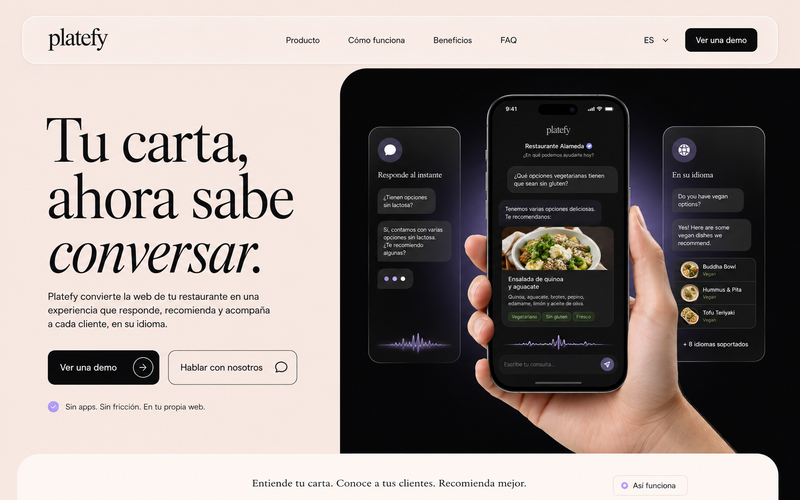

# Platefy

**Tu carta, ahora sabe conversar.**

Platefy is a multilingual AI assistant concept for restaurant websites. It turns a static menu into a conversational experience that can answer questions, explain ingredients, account for allergens and budgets, and recommend dishes with restaurant-specific context.

[Live website](https://platefy.samilososami.com) · [Open the mobile assistant](https://platefy.samilososami.com/app) · [Figma source](https://www.figma.com/design/E06pg24PfZREItq44no2le/platefy?node-id=0-1)



## What is included

- Spanish, English and Catalan experiences with persistent language selection.
- Responsive editorial landing page inspired by the original Figma direction.
- Liquid-glass navigation, cards, modal and interactive product scenes.
- Blur-based text reveals, smooth scrolling, parallax and ambient motion.
- Respect for `prefers-reduced-motion` and touch-first mobile behavior.
- Interactive assistant demo, conversation flow, menu transformation and FAQ.
- Dedicated mobile-first assistant at `/app`, with a cinematic welcome-to-chat transition.
- Reusable organic AI Orb with `appearing`, `idle`, `listening`, `thinking`, `speaking`, `success` and `error` states.
- Auto-growing composer, suggested questions, local restaurant-answer simulation and reactive message flow.
- Browser microphone capture, native speech recognition when available, amplitude-driven listening motion and speech synthesis.
- Pluggable `VoiceProvider` boundary and central brand tokens, ready for future STT/TTS services and restaurant theming.
- Bundled fonts and compressed transparent artwork; no third-party runtime assets.
- SEO basics, sitemap, robots file, security headers and an accessible semantic structure.

## Stack

- React 19 + TypeScript
- Vite
- Motion
- Lenis
- Lucide
- Vitest + Testing Library
- Vercel + Cloudflare DNS

## Run locally

Requirements: Node.js 24 and npm.

```bash
npm ci
npm run dev
```

The development server listens on `0.0.0.0`, so the same project can be run by either the regular user or root on the host.

## Quality checks

```bash
npm run check
```

This runs ESLint, the component test suite and a production build. See [the visual QA ledger](docs/QA.md) for the desktop/mobile fidelity review.

## Project structure

```text
src/
  assistant/    Mobile assistant, Orb, state controller and voice provider
  assets/       Optimised product artwork
  components/   Landing-page sections and interactions
  hooks/        Smooth-scroll integration
  content.ts    ES, EN and CA copy
docs/design/    Accepted visual concepts
```

## Product status

This repository contains the production marketing experience and the mobile assistant MVP. Restaurant knowledge ingestion, server-side AI responses, external STT/TTS and reservation flows are deliberately outside this phase; the current assistant keeps messages in the browser and uses curated local responses.

## License

[MIT](LICENSE)
